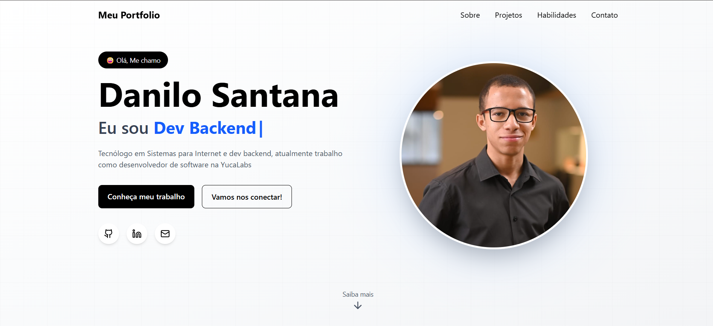

# 💼 Portfólio Pessoal

Este é o repositório do meu portfólio pessoal, desenvolvido com **React** e **Tailwind CSS**, com o objetivo de apresentar meus projetos, habilidades e experiências de forma moderna, responsiva e acessível.

---

## 🚀 Tecnologias Utilizadas

* ⚛️ **React** — Biblioteca JavaScript para construção de interfaces dinâmicas
* 🎨 **Tailwind CSS** — Framework utilitário para estilização rápida e responsiva
* 🌐 **HTML5 & CSS3**
* 🧠 **JavaScript (ES6+)**

---

## 📸 Preview



## ✨ Funcionalidades

* Layout responsivo (mobile-first)
* Navegação suave entre seções
* Seções de:

  * Sobre mim
  * Projetos
  * Habilidades
  * Contato
* Integração com redes sociais
* Design moderno e minimalista

---

## 📂 Estrutura do Projeto

```bash
├── public/
├── src/
│   ├── assets/
│   ├── components/
│   ├── pages/
│   ├── App.jsx
│   └── main.jsx
├── tailwind.config.js
├── package.json
└── README.md
```

## 📌 Melhorias Futuras

* Adicionar animações com Framer Motion
* Implementar modo escuro (dark mode)
* Integração com CMS para projetos dinâmicos
* SEO otimizado

---

## 📞 Contato

* LinkedIn: www.linkedin.com/in/danilo-santana-b8595326b
* Email: [dandan.santos3103@gmail.com](mailto:dandan.santos3103@gmail.com)

---

## 📄 Licença

Este projeto está sob a licença MIT. Sinta-se livre para utilizá-lo como base para o seu próprio portfólio.

---

## 🙌 Agradecimentos

Obrigado por visitar este repositório! Feedbacks são sempre bem-vindos.
